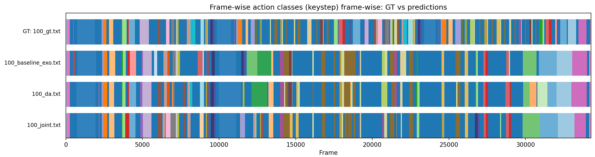

# Diffusion Models for Temporal Action Segmentation in industrial scenarios

Code for my master thesis in Computer Science (Data Science curriculum) at University of Catania, in collaboration with [Next Vision S.r.l.](https://www.nextvisionlab.it)

Advisor: Prof. Giovanni Maria Farinella <br>
Co-advisor: Dr. Rosario Leonardi

## Description

This repository extends [ActFusion](https://github.com/gongda0e/ActFusion) [1] (NeurIPS 2024), a unified diffusion model for Temporal Action Segmentation (TAS) and Long-Term Action Anticipation, to study the domain gap between **egocentric (EGO)** and **exocentric (EXO)** views on [ENIGMA-360](https://fpv-iplab.github.io/ENIGMA-360/) [2], an industrial multi-view video dataset for TAS.

Results indicates that a model trained on a single view generalizes poorly to the other (cross-domain evaluation drops by 58-61 F1@50 points). We propose a lightweight **domain adaptation method**, consisting in a **feature alignment** strategy: a cosine-similarity loss between EGO/EXO encoder embeddings of the same paired video, requiring no labels on the target view. This closes ~91% of the domain gap at a fraction of the training cost of fully-supervised joint training. The approach is validated against a baseline (single-view training), a joint-training upper bound, and a misalignment ablation study.

## Tech Stack

- Python 3.9
- PyTorch
- Weights & Biases (experiment tracking)
- NumPy / SciPy

See `requirements.txt` for the full list of dependencies.

## Quick Start

### Installation

```bash
git clone https://github.com/weiss25r/ActFusionPlus.git
cd ActFusionPlus
pip install -r requirements.txt
```

[Download the dataset](https://github.com/fpv-iplab/ENIGMA-360/tree/main?tab=readme-ov-file#downloading-the-dataset) and update the paths (`feature_dir`, `label_dir`, splits, etc.) in the relevant config file under `configs/`.

### Training

```bash
python main.py --config configs/<EXPERIMENT>/<config_name>.json --result_dir <run_name> --seed <seed>
```

`--seed` accepts any integer.

### Inference

Append `--test` to a training command to run inference on the test set using the corresponding checkpoint:

```bash
python main.py --config configs/<EXPERIMENT>/<config_name>.json --result_dir <run_name> --seed <seed> --test
```

## Overview

### Project structure

```
ActFusionPlus/
├── assets/              # figures and plots used in the thesis
├── configs/             # JSON configuration files, grouped by experiment
├── src/
│   ├── dataset.py         # dataset loading, preprocessing, temporal/spatial augmentation
│   ├── pipeline.py        # builds datasets/trainer, dispatches train/test
│   ├── trainer.py         # training loop, TAS/LTA evaluation, checkpointing
│   ├── utils.py           # metrics, mapping utils
│   ├── vis.py             # qualitative segmentation visualizations
│   └── model/
│       ├── actfusion.py    # ActFusion model: masking strategies, diffusion loss, feature alignment
│       ├── backbone.py     # encoder/decoder backbones
│       ├── attn.py         # dilated attention + cross-attention modules
│       ├── diffusion.py    # Gaussian diffusion process (forward/reverse)
│       ├── diffusion_utils.py
│       └── grl.py          # gradient reversal layer (exploratory adversarial DA)
├── main.py                # CLI entrypoint
├── pipeline.png            # architecture diagram from original authors
└── requirements.txt
```

### Experiments

Each experiment family has its own config folder under `configs/`:

- **Baseline** — single-view training (EGO-only or EXO-only), evaluated on both views.
- **Feature Alignment (DA)** — baseline training + cosine-similarity loss aligning EGO/EXO encoder embeddings of paired videos.
- **Misaligned ablation** — feature alignment with shuffled (non-corresponding) EGO/EXO pairs, to validate that the gain comes from the true pairing and not from generic regularization.
- **Joint Training** — both views in the training set (supervised upper bound).

## Results
### Metrics (EXO test set)


| Experiment                        | Acc            | Edit           | F1@10          | F1@25          | F1@50              |
|-------------------------------------|-----------------|-----------------|-----------------|-----------------|---------------------|
| Baseline (Train EGO)                | 26.34 ± 0.96    | 36.02 ± 0.48    | 27.31 ± 0.71    | 20.41 ± 0.59    | 9.18 ± 0.15         |
| Baseline (Train EXO)                | 69.92 ± 0.37    | 80.56 ± 0.65    | 80.73 ± 0.33    | 75.46 ± 0.34    | 57.39 ± 0.33        |
| DA (Source EGO, Target EXO)         | 69.71 ± 0.42    | 79.23 ± 0.52    | 79.18 ± 0.17    | 73.54 ± 0.30    | **55.08 ± 0.06**    |
| DA (Source EXO, Target EGO)         | 69.52 ± 0.53    | 79.62 ± 0.21    | 79.86 ± 0.27    | 74.53 ± 0.42    | **56.39 ± 0.25**    |
| MIS-DA (Source EGO, Target EXO)     | 25.37 ± 0.55    | 38.10 ± 0.77    | 26.23 ± 0.45    | 18.95 ± 0.72    | 8.29 ± 0.83         |
| Joint (Train EGO + EXO)             | 73.19 ± 0.16    | 83.65 ± 0.23    | 83.32 ± 0.17    | 78.18 ± 0.18    | **60.42 ± 0.24**    |
### Qualitative
The following figure provides qualitative segmentation results on video "100" EXO



## Acknowledgement & Citation

This repository builds upon [ActFusion](https://github.com/gongda0e/ActFusion) and [ENIGMA-360](https://github.com/fpv-iplab/ENIGMA-360). Thanks to the original authors.


[1] Gong, D., Kwak, S., & Cho, M. (2024). ActFusion: A Unified Diffusion Model for Action Segmentation and Anticipation. Advances in Neural Information Processing Systems, 37, 89913–89942.

[2] Francesco Ragusa, Rosario Leonardi, Michele Mazzamuto, Daniele Di Mauro, Camillo Quattrocchi, Alessandro Passanisi, Irene D'Ambra, Antonino Furnari, & Giovanni Maria Farinella. (2026). ENIGMA-360: An Ego-Exo Dataset for Human Behavior Understanding in Industrial Scenarios.


## 📄 License

This project is licensed under the [MIT License](./LICENSE).
